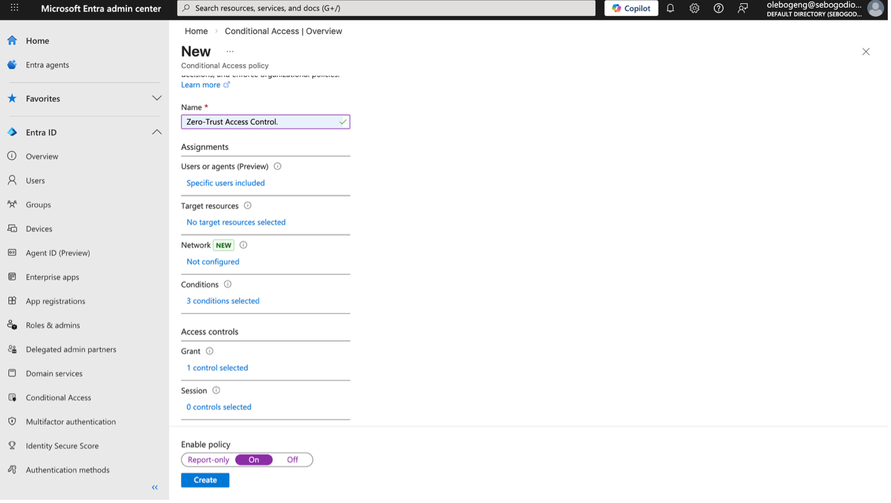
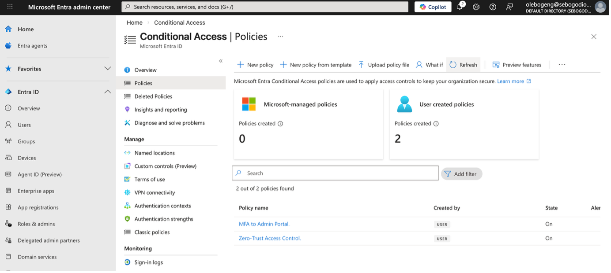
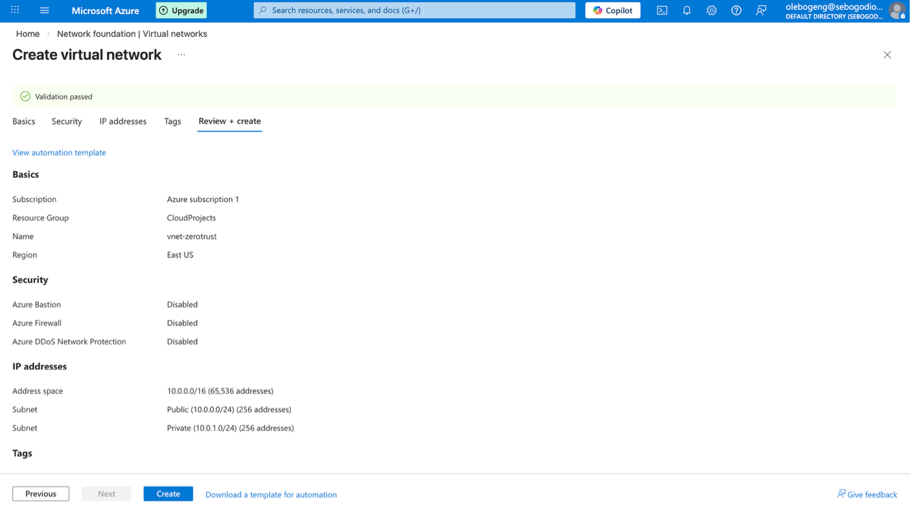
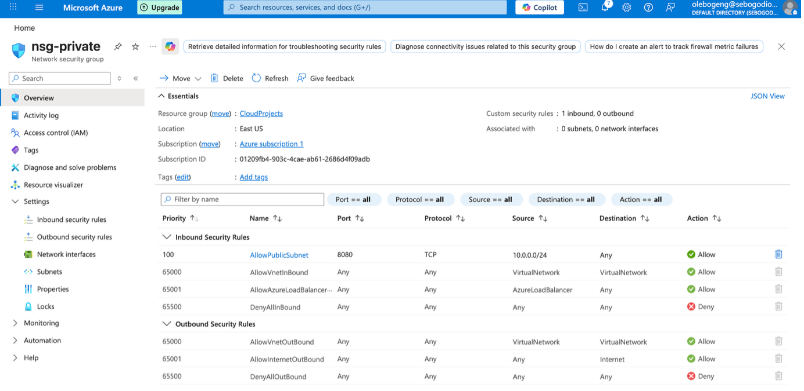
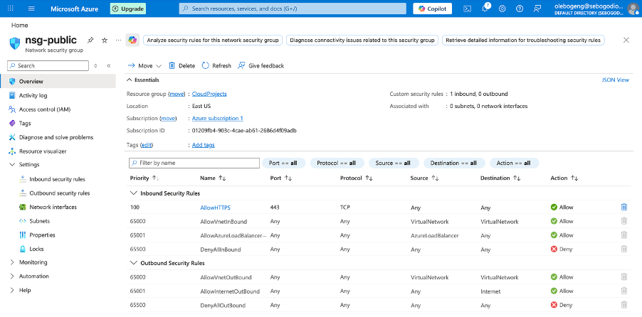
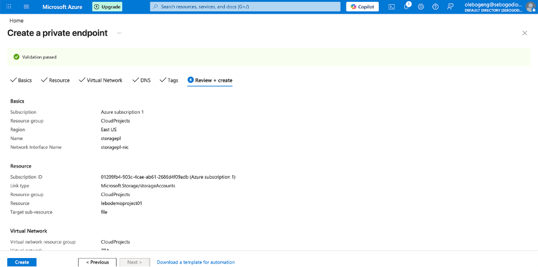
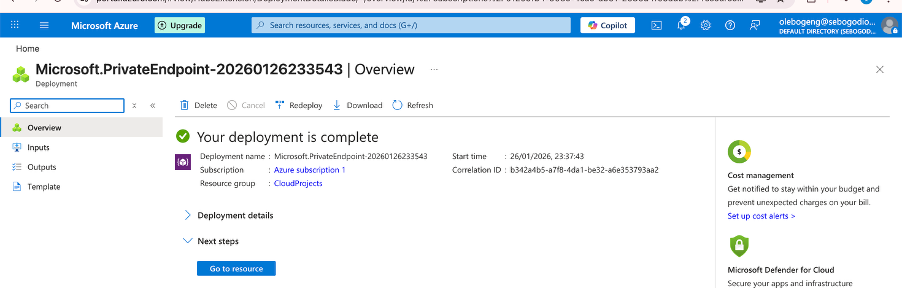

# 🔐 Azure Project — Implement a Zero-Trust Architecture

> **Author:** Olebogeng Sebogodi  
> **Category:** Cloud Security / Identity & Access Management  
> **Platform:** Microsoft Azure

---

## 📖 Table of Contents
- [Project Overview](#-project-overview)
- [Architecture Goals](#-architecture-goals)
- [Prerequisites](#-prerequisites)
- [High-Level Architecture](#-high-level-architecture)
- [Step-by-Step Implementation](#-step-by-step-implementation)
  - [1. Conditional Access & Identity Protection](#1-conditional-access--identity-protection)
  - [2. Multi-Factor Authentication (MFA)](#2-multi-factor-authentication-mfa)
  - [3. Network Segmentation & Private Access](#3-network-segmentation--private-access)
  - [4. Monitoring & Logging](#4-monitoring--logging)
- [Validation](#-validation)
- [Security Outcomes](#-security-outcomes)
- [Lessons Learned](#-lessons-learned)
- [References](#-references)

---

## 📘 Project Overview
This project demonstrates how to implement a **Zero-Trust security architecture** in Microsoft Azure.

---

## 🎯 Architecture Goals
- Enforce identity verification
- Protect accounts with MFA
- Segment networks
- Restrict access via private endpoints
- Monitor and audit all activity

---

## ✅ Prerequisites
- [ ] Azure subscription  
- [ ] Global/Security Admin role  
- [ ] Azure Portal access  
- [ ] Basic knowledge of Azure Entra ID, VNets, NSGs, Azure Monitor  

---

## 🛠 Step-by-Step Implementation

### 1. Conditional Access & Identity Protection

**Policy Creation**

1. Open **Azure Portal**
2. Navigate to **Entra ID → Security → Conditional Access**
3. Create a new policy:  
   `Zero-Trust Access Control`
4. Configure:
   - Users: Selected group (e.g., Admins)
   - Conditions: Sign-in risk
   - Grant: Require MFA
5. Enable the policy

✔ Outcome: High-risk sign-ins now require additional verification.

**Policy Enabled**

---

### 2. Multi-Factor Authentication (MFA)

**MFA Policy Configuration**

1. Go to **Entra ID → Security → Conditional Access**
2. Create a new policy:
  `MFA to Admin Portal`
3. Configure:
    - Users: “All Users”.
    - Target resources: Microsoft Admin Portal
    - Conditions: Sign-in risk, to High and Medium.
    - Grant: Require multi-factor authentication (MFA).
5. Enable the policy

✔ Outcome: Accounts are protected with layered authentication.

---

### 3. Network Segmentation & Private Access

#### A. VNet & Subnets

- Create a VNet: `VNet-ZeroTrust`
- Subnets:
  - `Public`
  - `Private`

#### B. Network Security Groups
- Attach NSGs to each subnet
- Rules:
  - Private
    - Allow trusted IPs
  - Public
    - Allow HTTPS from internet
 
 

#### C. Private Endpoints

- Create private endpoints for:
  - Storage
- Configure private DNS

✔ Outcome: Resources are no longer exposed publicly.

---

### 4. Monitoring & Logging

**Log Analytics Workspace**

1. Open **Azure Monitor**
2. Enable Diagnostic Settings for:
   - Sign-in logs
   - Conditional Access logs
   - Network logs
3. Send logs to **Log Analytics Workspace**

---

## 🧪 Validation

 - Attempt login without MFA → ❌ Blocked
 - Access private service from internet → ❌ Denied
 - View logs in Log Analytics → ✅ Visible

 ✔ Outcome: Full visibility into risky behavior

---

## 🔐 Security Outcomes

 - Identity is continuously verified
 - Privileged access is restricted
 - Network is segmented
 - Sensitive services are private
 - All activity is logged and auditable

---

## 📚 Lessons Learned

 - Zero-Trust is identity-first
 - MFA is essential, not optional
 - Network segmentation reduces attack paths
 - Logs are your best defense

---

## 🔗 References

- Microsoft Zero Trust Framework  
- Azure Entra ID Documentation  

---

> **Built by:** Olebogeng Sebogodi  
> GitHub: https://github.com/Olebxgeng  
